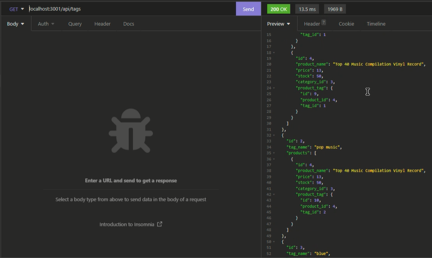

# E-Commerce Backend: Proof of Concept
## Description

This program is a proof of concept for an ecommerce site backend using MySQL and NodeJS. The database contains products, categories, and tags with relevant information for each. Products can be assigned to a category, such that a category can contain multiple products, but products only fall into one category. Products may also have tags assigned, such that a single product may have multiple tags, and tags can also be assigned to multiple products. New categories, tags, and products may be created, updated, as well as deleted from the ecommerce database.

## Table of Contents

- [Installation](#installation)
- [Usage](#usage)
- [License](#license)
- [Contributing](#contributing)
- [Questions](#questions)

## Installation

1. Make sure you have downloaded and installed [node.js](https://nodejs.org/en/download/)
2. Download a .zip of this repository, or clone the repository into a new directory using Git.
3. Open a terminal window in the location of the extracted or cloned files and run ```node install``` to ensure the necessary packages will be included. You should see a new folder called "node_modules" appear in the directory.

## Usage

1. Create a file ".env" in the source folder. In this ```.env``` file, enter:
```
DB_NAME='ecommerce_db'
DB_USER='root'
DB_PW='***********'
```

Replace the *********** with your mysql password.

2. Type ```mysql -u root -p``` into your command line shell and press Enter. You will be prompted to enter your mysql password (the same password as used in step 1). Enter your password and press Enter.
3. Type ``` source db/schema.sql ``` and press Enter to initialize the database. Quit out of mysql by typing ``` quit ``` into the command line and pressing Enter.
4. Seed the database by typing ``` npm run seed ``` into the terminal and press Enter.
5. After it has finished seeding, start the server by typing ``` node server.js ``` and pressing Enter.
6. Now you can test all routes using insomnia or another RESTful API client.

Watch a brief video demonstrating usage:

[](https://drive.google.com/file/d/1bq2RwMGfO1xGeJGWlhvSExc0pdiVCmCD/view)

## License

[](https://opensource.org/licenses/MIT)

## Contributing

* Professional readme template generated using [https://github.com/chardmuffin/readme-generator-rth](https://github.com/chardmuffin/readme-generator-rth)
* Uses the [Sequelize](https://sequelize.org/) and [MySQL2](https://www.npmjs.com/package/mysql2) packages to connect to a MySQL database
* Uses the [dotenv package](https://www.npmjs.com/package/dotenv) to use environment variables to store sensitive data, like a user’s MySQL username, password, and database name

## Questions

I am on GitHub: [https://github.com/chardmuffin](https://github.com/chardmuffin)

I can also be reached by email at [richardhuffman96@gmail.com](mailto:richardhuffman96@gmail.com)